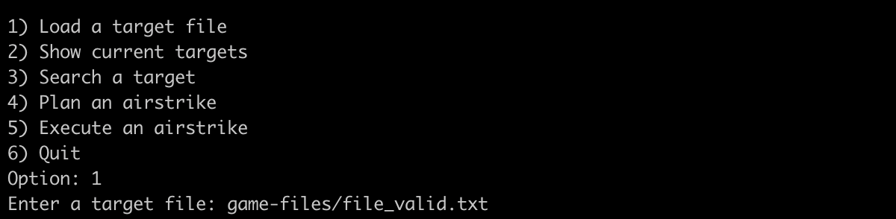
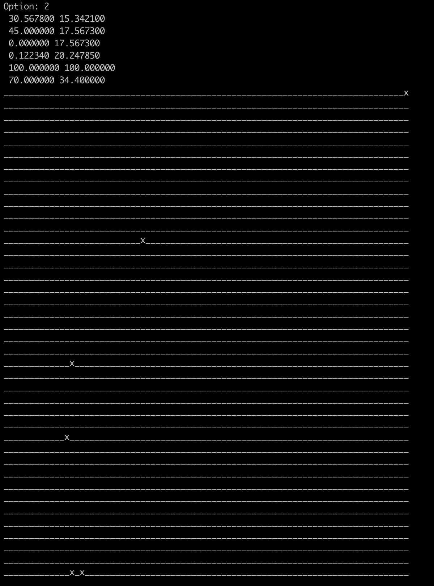

  

# Battleships

Battleships (or Battleship) is a game where each player has a board upon which they can place a number of ships. 
The boards are on a 100x100 two dimensional grid. This game is designed to be played by a single player.

## Quick start
### Windows
Compile the source code by executing `gcc game.c -o game.exe` form the project directory.
Then run the executable by executing `game.exe`.

### Mac OS
Compile the source code by executing `gcc -Wall -o game game.c` form the project directory.
Then start the game by executing `./game`.

## How to play
### 1) Load a target file

Files available:
- game-files/file_conflict.txt
- game-files/file_dot1.txt
- game-files/file_dot2.txt
- game-files/file_duplicates.txt
- game-files/file_invalid1.txt
- game-files/file_invalid2.txt
- game-files/file_valid.txt

### 2) Show targets
Displays all targets that were already found.

### 3) Search a target
Displays all targets that were already found.

### 4) Plan an airstrike
Lets you enter the latitude and longitude for a strike

### 5) Execute an airstrike
Execute a strike you planned in the previous step
